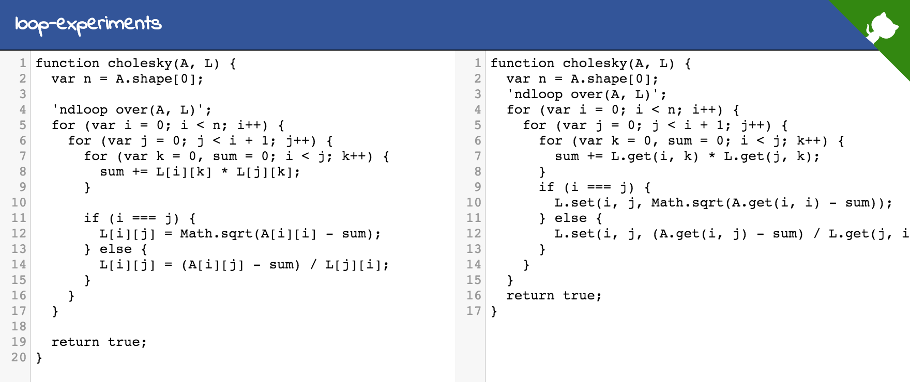

# ndloops

> Experiments with code transformation

### Goal

The goal of this project is to solve the problem of having to write numerical javascript code that handles `ndarrays` (backed by either an array or by `.get`/`set`), `Arrays` of `Arrays`, vanilla `Arrays` and similar storage formats. The transformation is trivial; maintaining five versions of the same code to handle all combinations of inputs is not.

### Progress

***tl;dr:*** It's just a start, but here's a [live demo](http://rreusser.github.io/loop-experiments) that translates array-of-arrays notation into get/set notation:

[](https://rreusser.github.io/loop-experiments)

This example takes a [Cholesky decomposition](https://en.wikipedia.org/wiki/Cholesky_decomposition) indexed using array-of-arrays-style indexing, that is, for example, `A[i][j]` notation. Since storing arrays of arrays isn't always the most efficient, we may wish to use write `A.get(...)` and `A.set(...)` or just unroll the pointer arithmetic instead.

Unfortunately, handling different formats like this usually requires separate code for each storage format. `.get`/`.set` is often a solution that lets code interface with any sort of underlying storage format, but for numerical code, the overhead is too great.

This project is an attempt to explore possible solutions. Of course in the end, it'll probably just be necessary to write a lot of code anyway, but this is me imagining that there's a more elegant solution.

This repo uses esprima to transform the abstract syntax tree (AST) of the code. OpenMP `#pragma omp`-style directives guide the transformation, instructing plugins how and where to translate. To make the transformation (currently hard-coded to translate index notation to get/set notation), run:

```javascript
loopTools.parse(cholesky).transform(ndloops()).generate();
```

Plugins can utilize other plugins, operate in sequence... whatever you want, really.

### What's next?

Get/set notation is expensive and not particularly interesting. The next step is to move to more direct pointer indexing for ndarrays backed by actual arrays. This means tracking lvalues and rvalues through the for loops and hosting pointer-like arithmetic so that it doesn't compute index offets unnecessarily. Block indexing and for loop reordering for performance is also a reasonable extension, but requires careful tracking of index dependencies and a fair amount more footwork.

Also next is creating a realistic workflow for making runtime decisions on which sort of indexing is necessary and for transforming the result back into cached functions.

### Is it flexible?

The transformation is plugin-based, which means you can apply a sequence of transformations. Each transformation, in turn, can apply plugins itself to all or part of the AST. This allows you to abstract out the transformations and make complex changes to the AST.

### Is esprima a runtime dependency?

Up to you. The goal is to apply transformations and output beautiful, human-readable code. Even if it took 30s and 1MB of minified js to process your code and spit out nicely optimized code, you can always just use the end result and leave out esprima from your runtime dependencies. Enumeration of basic inputs could even be done in a prepublish step so that you commit your `.get`/`.set` code and publish an enumeration over datatypes.

Another possibility is to precompile and package the AST and only include `escodegen` as a dependency. But of course if it's easier to just let esprima do it's thing live and cache the resulting function, then that works too.

## License

&copy; 2016 Ricky Reusser. MIT License.
